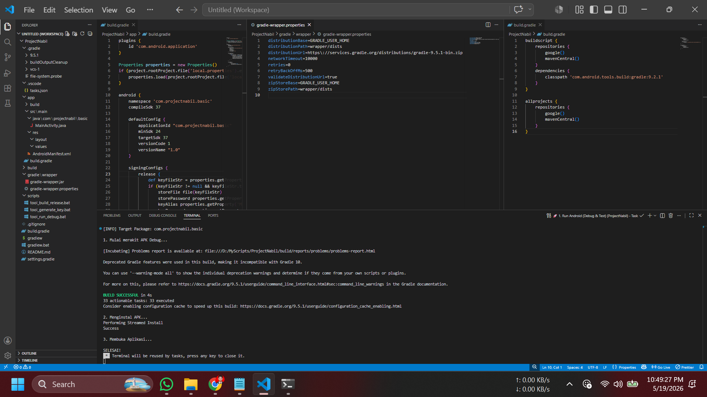

# 📱 Android Native VS Code Template (Ultra-Lightweight)

   

A bleeding-edge, ultra-lightweight boilerplate to build Native Android applications (Java & XML) using **Visual Studio Code** and **Terminal**. 

Completely bypasses the heavy Android Studio. Perfect for developers with low-end laptops (Potato PCs) who still want to use the latest Android API 37 and Gradle 9.x without melting their CPU.

Built with ❤️ from Indonesia. Designed specifically to help developers worldwide who code on low-specs machines.


*(Clean, fast, and fully automated build process straight from VS Code)*

## ✨ Why This Template?
* **Zero Android Studio Needed:** Runs purely on Gradle and Command-Line.
* **No Laptop Overheating:** We removed the heavy Red Hat Java Language Server. We use lightweight formatters instead.
* **Modern Standard:** Pre-configured with **Android API 37**, **Gradle 9.5.1**, and **AGP 9.2.1**.
* **Global SDK Path:** Uses `ANDROID_HOME`. No need to hardcode your SDK path in `local.properties` anymore!
* **1-Click Automation:** Comes with custom `.bat` scripts cleanly organized in the `scripts/` folder.

---

## 🛠️ One-Time Setup (Prerequisites)

To build Android apps without Android Studio, you only need to set up these tools once on your Windows machine:

### 1. Install Java (JDK 17 or higher)
* Download **Microsoft Build of OpenJDK** (Recommended for VS Code): [Download here](https://learn.microsoft.com/en-us/java/openjdk/download)
* Install it and ensure `JAVA_HOME` is added to your Environment Variables. *(Works flawlessly up to JDK 25!)*.

### 2. Install Android SDK & Set `ANDROID_HOME`
We will download the raw Android SDK without the heavy IDE.
1. Download the **"Command line tools only"** `.zip` for Windows from the [Android Studio Page](https://developer.android.com/studio).
2. Extract and organize it exactly like this: `D:\AndroidSDK\cmdline-tools\latest\bin\sdkmanager.bat` *(You must manually create the `latest` folder)*.
3. Open Windows **Environment Variables**:
   * Create a new System Variable: `ANDROID_HOME` = `D:\AndroidSDK`
   * Edit the `Path` variable and add: `D:\AndroidSDK\cmdline-tools\latest\bin`
   * Edit the `Path` variable and add: `D:\AndroidSDK\platform-tools`
4. Open Command Prompt and download the required packages (API 37):
   ```cmd
   sdkmanager "platforms;android-37.0" "build-tools;37.0.0" "platform-tools"
   ```

### 3. VS Code Lightweight Extensions
Do NOT install the heavy "Extension Pack for Java". Install these instead to keep your editor blazing fast:
* 🧩 **[Prettier - Code formatter](https://marketplace.visualstudio.com/items?itemName=esbenp.prettier-vscode)**
* ☕ **[Prettier Java Plugin](https://marketplace.visualstudio.com/items?itemName=RudraPatel.prettier-plugin-java-vscode)**
* 📝 **[XML Tools](https://marketplace.visualstudio.com/items?itemName=DotJoshJohnson.xml)**

---

## 🚀 Getting Started

Since we use `ANDROID_HOME`, the setup is completely plug-and-play!

1. **Clone the repository:**
   ```bash
   git clone https://github.com/yourusername/android-vscode-template.git
   cd android-vscode-template
   ```

2. **Open in VS Code:**
   ```bash
   code .
   ```

3. **Plug in your Android Phone** (Ensure USB Debugging is enabled).

---

## 🎮 How to Use (Integrated Tasks)

You don't need to memorize any terminal commands. Just press **`Ctrl + Shift + B`** (or go to *Terminal -> Run Task...*) and select:

* 🚀 **1. Run Android (Debug & Test):** 
  * Automatically builds the debug APK, installs it, and launches the app on your phone. Perfect for your daily coding workflow.
  
* 💎 **2. Build APK (Official Release):** 
  * Builds a highly optimized, signed Release APK ready for the Play Store. Uninstalls the old debug version automatically to prevent signature clashes.
  * ⚠️ **IMPORTANT FOR BEGINNERS:** You **cannot** run this task immediately. You must run **Task 3 (Generate Keystore)** first to create your app's signature!
  
* 🔑 **3. Generate Keystore (Run once before Release):** 
  * An interactive prompt to create a `.jks` app signature. It securely auto-generates a `local.properties` file to store your passwords (which is safely ignored by Git!). **Run this task once before building your first Official Release.**

## 📜 License
This project is licensed under the MIT License. Feel free to clone, modify, and build your empire from a potato PC!